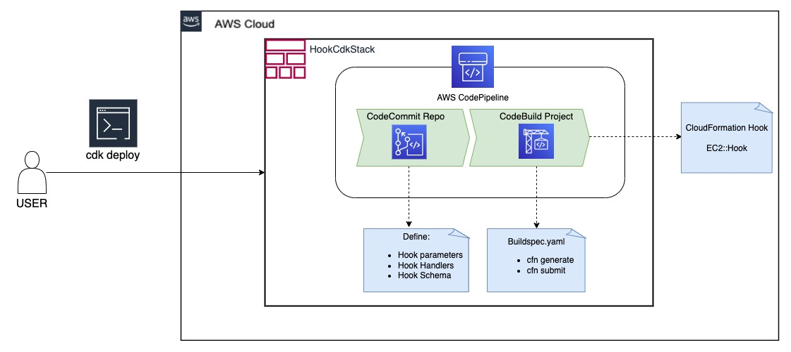
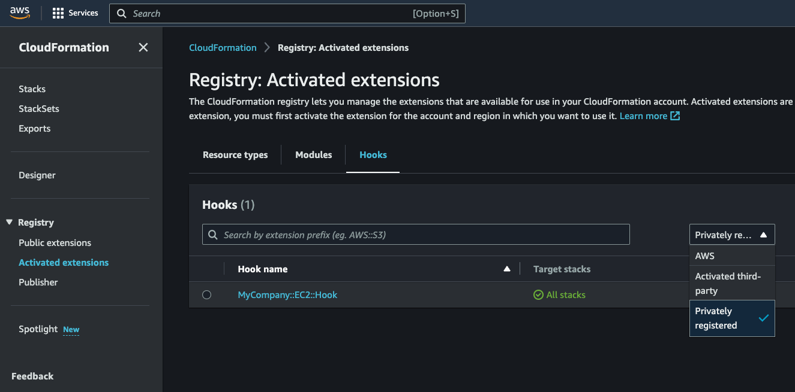
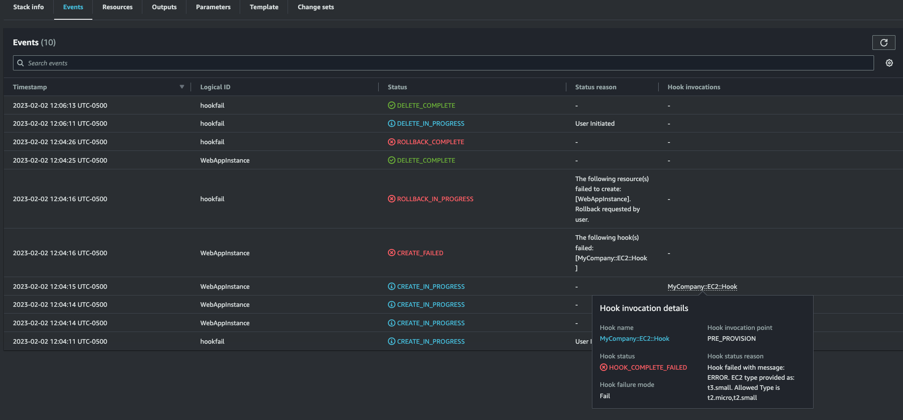
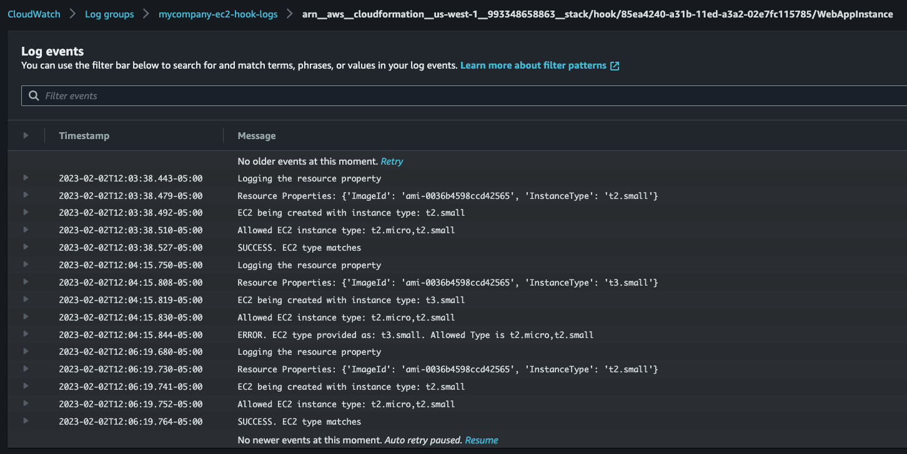

# Build and Deploy CloudFromation hook using CI/CD Pipeline

<!-- vscode-markdown-toc -->
# Table of Contents
- [**Overview**](#overview)
- [**Solution**](#solution)
- [**Target Architecture**](#arch)
- [**Repository Structure**](#repo)
- [**Deployment Steps**](#deploy)
- [**Verification**](#verification)
- [**Create New Hook**](#newhook)
- [**Clean Up**](#cleanup)
- [**Conclusion**](#conclusion)


# <a name='overview'></a>Overview

AWS CloudFormation Hooks are a feature within the AWS CloudFormation service that allows users to execute custom actions at specific points in the lifecycle of a CloudFormation stack. Hooks can be used to perform additional tasks, such as validating input parameters, updating resources, or triggering notifications. Hooks are defined as Lambda functions and can be easily integrated into a CloudFormation stack to enhance its functionality and automate complex processes. These hooks provide a flexible and efficient way to manage the lifecycle of a CloudFormation stack, enabling users to automate and standardize deployment and management tasks. 

CloudFormation Hooks proactively inspect the configuration of your AWS resources before provisioning. If non-compliant resources are found, AWS CloudFormation returns a failure status and either fails the operation or provides a warning and allows the operation to continue based on the hook failure mode. Organizations can develop custom rules for proactive compliance. This pattern demonstrates how to create, update, and deploy CloudFormation hooks through a CI/CD pipeline using AWS Cloud Development Kit as Infrastructure as Code.

# <a name='solution'></a>Solution

This pattern demonstrates how to create, update, and deploy CloudFormation hooks through a CI/CD pipeline using AWS Cloud Development Kit as Infrastructure as Code.
This solution leverages AWS CDK (Python) to deploy the following components:

- AWS CodeCommit source repo that contains hook handlers, hook schema and other parameters to create the hook and its related configuration
- AWS CodeBuild stage to package and deploy the hook
- AWS CodePipeline 

In this pattern, we  created one CloudFormation hook (`MyCompany::EC2::Hook`) that is triggered before any EC2 instance is created via CloudFormation stack. This hook will check for the instance type and will only allow the process to continue if it matches with `instancetype` defined in the hook properties in the hook scheme file (`repo/hooks/mycompany-ec2-hook/mycompany-ec2-hook.json`). In this example, allowed instance type is defined as  `t2.micro,t2.small`

The hook handler (`repo/hooks/mycompany-ec2-hook/src/mycompany_ec2_hook/handlers.py`) implementes the  logic that compares  the ec2 instance type provided by the CloudFormation with allowed list and sends success/failure msg.

# <a name='arch'></a>Target Architecture



# <a name='repo'></a>Repository Structure


The code repo contains the following files and folders.

`repo` – The content of this folder will be copied over to a newly created AWS CodeCommit Repo. This CodeCommit Repo will be the source of the pipeline. It contains the following files/folders.

- `hook` - This folder contains subfolder related to each cfn hook. Each subfolder can contain following files
    - `src/mycompany_ec2_hook/handlers.py` - Lambda function code that runs as CloudFormation hook. It contains the business logic for your hook.

    - `parameter.json` – The configuration parameter file for the hook. Check [here](#parameterdetails) for details.

    - `mycompany-ec2-hook.json` - Hook Schema File. For more information, visit [page](https://docs.aws.amazon.com/CloudFormation-cli/latest/userguide/hooks-structure.html)

    - `requirements.txt` - Contains list of python packages needed to create and deploy the hooks
    - `.ignore` - Optional file. If this file exists, CodeBuild will skip building this hook. By default this file does not exist. 
- `test_ec2_template` - This folder contain a sample CFN stack to deploy EC2 instance
- `build_hook.sh` - This script is executed in CodeBuild Phase. It iterates over the sub-folders inside **hooks** to build the hooks.
- `buildspec.yaml` - Contains list of commands executed during CodeBuild Stage
- `create_hook.sh` - This script is used to create new CFN hooks. Details can be found in `Create New Hooks` section
- `create_hook.json` - This is the input file for the script **create_hook.sh**. Details can be found in `Create New Hooks` section

`hook_cdk`  – This folder contains CDK Code and Modules

`app.py` - Entry point for the CDK application

`requirements.txt` - Contains list of python packages needed to deploy the cdk application.

# <a name='deploy'></a>Deployment Steps

## Pre-requisites

- [AWS CDK v2](https://docs.aws.amazon.com/cdk/v2/guide/getting_started.html)
- An AWS account and accompanying credentials
- [Python](https://www.python.org/downloads/) 
- [Git](https://git-scm.com/downloads)
- A web browser that is supported for use with the AWS Management Console. See the [list](https://aws.amazon.com/premiumsupport/knowledge-center/browsers-management-console/) of supported browsers.


## Create python virtual environment and install dependencies

To manually create a virtualenv on MacOS and Linux:

```
$ python3 -m venv .venv
```

After the init process completes and the virtualenv is created, you can use the following
step to activate your virtualenv.

```
$ source .venv/bin/activate
```

If you are a Windows platform, you would activate the virtualenv like this:

```
% .venv\Scripts\activate.bat
```

Once the virtualenv is activated, you can install the required dependencies.

```
$ pip install -r requirements.txt
```

## Bootstrap CDK environment 

```
cdk bootstrap aws://<ACCOUNT_ID>/<ACCOUNT_REGION>
```

## Deploy the Solution
Set account id and region

```
export CDK_REGION=<ACCOUNT_REGION>
export CDK_ACCOUNT=<ACCOUNT_ID>
```
At this point you can now synthesize the CloudFormation template for this code.

```
$ cdk synth
```
Deploy the solution with cdk deploy

```
$ cdk deploy
```

Get the Repository Name ``` RepositoryName ``` from the CloudFormation stack output from the CloudFormation console or using the AWS CLI:

```
aws CloudFormation describe-stacks --stack-name HookCdkStack --query "Stacks[0].Outputs[0].OutputValue"
```


<a name='parameterdetails'></a>Update `parameter.json ` in the **repo** folder accordingly:

```
{
    "failure_mode": "FAIL",
    "target_stack": "ALL" 
}
```

`failure_mode` -  Your hook logic can return success or failure. A success response will allow the operation to continue. A failure for non-compliant resources can result in the following:

- FAIL – Stops provisioning resources.

- WARN – Allows provisioning to continue with a warning message.

`target_stack` is used to turn the hook on or off. Valid values ALL or NONE

- target_stack set to **ALL** turns the hook on for all stack operations.

- target_stack set to **NONE** turns the hook off, so it doesn't apply to stack operations.

For more information, please check the hook confirmation schema in this [page](https://docs.aws.amazon.com/CloudFormation-cli/latest/userguide/hooks-structure.html)

## Run the Pipeline

Navigate to AWS CodePipeline and find the pipeline beginning with the name: HookCdkStack. 

Click **Release change** at the top right to execute the hook pipeline, applying your most recent changes to the hook configuration. Alternatively, you can commit the new changes to the repo and that will trigger the pipeline.

# <a name='verification'></a>Verification

Once the pipeline completes, navigate to the CloudFormation console. On the left menu locate the Registry, click Activated extensions, Hooks tab (filter with Privately Registered), and locate the EC2 hook. 



Click on the hook name to review it’s schema, configuration, and target resource type used to invoke the hook.

## Testing - Deploy an EC2 instance

A sample CFN template to create EC2 instance is provided in Test Folder. Deploy this sample stack with EC2 instance type. 

```
aws CloudFormation create-stack --stack-name <Stack_Name --region <AWS_Region> --template-body file://test_ec2_template/ec2.yaml
```
The stack would fail if the instance type is not listed in ec2_instance_type_allowed property. the following screenshot shows a stack fail scenario where ec2 instance type does not match with ec2_instance_type_allowed property



Alternatively, you can also view the CloudWatch logs to get more details



# <a name='newhook'></a>Create a New Hook

Every subfolder inside the **hooks** folder represents one CFN hook. To create a new CFN hook, follow the below procedure which will create and initialize a new subfolder with the new hook name.

1. Get the Repository Name ``` RepositoryName ``` from the CloudFormation stack output
1. Clone the Repo. Example - 
    ```
    git clone <URL of MyRepositoryNameHook CodeCommit Repo>
    ```

1. Change directory
    ```
    cd MyRepositoryNameHook
    ```
1. Update create_hook.json file
    ```
    {
        "company_name": "mycompany",
        "service_name": "SNS",
        "hook_name": "HOOK",
        "failure_mode": "WARN",
        "target_stack": "ALL"
    }
    ```

    `company_name`, `service_name`, and `hook_name` - These 3 parameters determine the unique name for your hook.Specify a three-part namespace for your hook, with a recommended pattern of **Organization::Service::Hook**. For example, the above parameter will the create the hook with the name **mycompany::SNS::Hook**.


    `failure_mode`, `target_stack` -  check [here](#parameterdetails)

1. Run `chmod +x create_hook.sh` and execute the script.

    The script will create a new sub-folder (based on new hook name) inside **hooks** folder and runs `cfn init` which will generate the required files to start your hook project:
    - `src/handler.py` - Business logic which is executed then the hook is invoked. Update it based on your requirement.
    - `src/models.py` - Do not edit, this file is managed cfn cli
    - `hook-name.json` - Add any required properties and permissions for your `typeConfiguration` 
    - `parameter.json` - Used to establish your hook configuration


   >Note - This will just create the skeleton and folder/file structure of the new hook. you need to update handlers and hook schema based on your requirement. Example hooks can be found [here](https://github.com/aws-CloudFormation/aws-CloudFormation-samples).

1. Commit these changes. This will trigger the pipeline. Pipeline will scan the newly created sub-folder inside **hooks** folder and create/build the hooks appropriately. Optionally you can place a `.ignore` file inside the subfolder to skip the hook build process for that hook.

# <a name='cleanup'></a>Clean Up

To clean-up resources created, deregister the EC2 hook. Deregistering a hook type marks the extension or extension version as DEPRECATED in the CloudFormation registry, which removes it from active use.
```
aws cloudformation deregister-type --type HOOK --type-name MyCompany::EC2::Hook
```

Note: If there is more than one registered version of the hook, each version must be de-registered.

```
aws cloudformation deregister-type --arn arn:aws:cloudformation:<region>:<account>:type/hook/<hook-name>/<version>
```

Delete the CDK stack HookCdkStack with:

```
cdk destroy
```

If necessary, remove the CDK bootstrap stack and CloudFormation CLI bootstrap stack with:

```
aws cloudformation delete-stack --stack-name CDKToolkit
```

```
aws cloudformation delete-stack --stack-name CloudFormationManagedUploadInfrastructure
```

# <a name='conclusion'></a>Conclusion

This patterns demonstrate how to create, build, and deploy CFN hooks to enforce proactive compliance using a CI/CD pipeline. This solution enables developers to check for compliance even before provisioning the resource. 

## Security

See [CONTRIBUTING](CONTRIBUTING.md#security-issue-notifications) for more information.

## License

This library is licensed under the MIT-0 License. See the LICENSE file.

